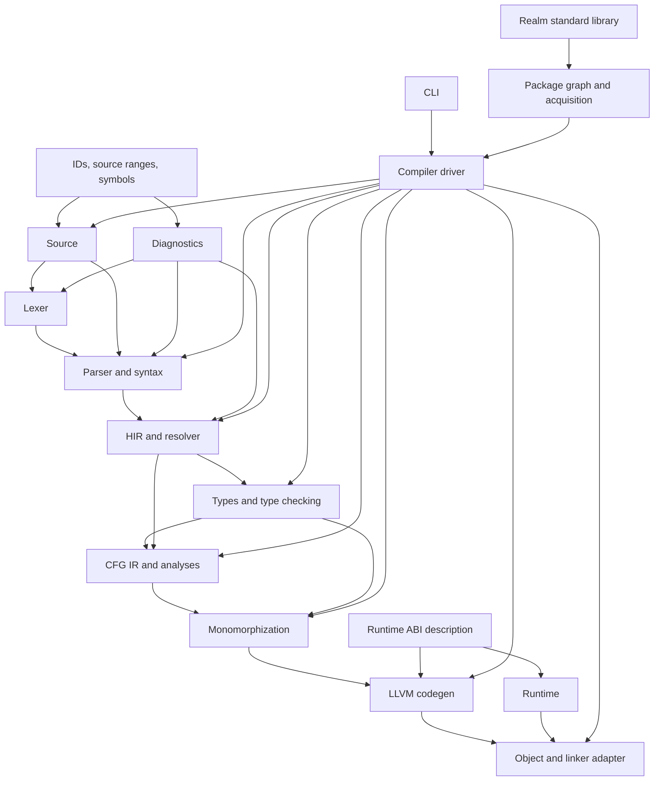

## Architectural Drivers

The architecture optimizes for correctness, stage isolation, early native
execution, ownership-aware concurrency, and later tooling reuse. It deliberately
does not optimize the first implementation for incremental compilation,
multi-target support, self-hosting, or maximum compiler throughput.

The following rules govern every component:

* A stage consumes immutable inputs and returns a value plus diagnostics; it does
  not print or terminate the process
* Source locations use opaque file IDs and UTF-8 byte ranges
* Syntax contains no semantic identity, inferred type, ownership fact, or LLVM
  object
* Semantic entities use stable IDs rather than Rust references into earlier
  representations
* CFG IR is the final authority for executable control flow, cleanups,
  suspension, and unwind edges
* LLVM generation receives validated, monomorphic input and cannot repair
  semantic errors
* Runtime ABI calls pass through one lowering boundary and a versioned ABI
  description
* CLI, filesystem, network, process, and terminal concerns remain at outer
  boundaries

The staged approach follows the production precedent in the
[rustc overview](https://rustc-dev-guide.rust-lang.org/overview.html), which
separates syntax, HIR, typed representations, CFG-oriented MIR, monomorphization,
and LLVM generation. Realm uses fewer capabilities at first but keeps equivalent
responsibility boundaries.

## Compiler Pipeline

```mermaid
flowchart LR
    CLI[CLI and build request] --> SM[Source manager]
    SM --> LX[Lexer]
    LX --> PS[Recoverable parser]
    PS --> CST[Lossless CST and AST facade]
    CST --> COL[Item and import collection]
    COL --> RES[Name resolution]
    RES --> HIR[Resolved HIR]
    HIR --> TY[Type, effect, and constraint checking]
    TY --> THIR[Typed HIR]
    THIR --> CFG[CFG construction and desugaring]
    CFG --> FLOW[Initialization, move, borrow, and cleanup analysis]
    FLOW --> GEN[Generic instance collection]
    GEN --> MONO[Monomorphic CFG IR]
    MONO --> LLVM[Inkwell LLVM IR generation]
    LLVM --> VERIFY[Verify and optimize]
    VERIFY --> OBJ[COFF object emission]
    OBJ --> LINK[MSVC-compatible linker adapter]
    RT[Realm runtime and native support] --> LINK
    STD[Realm standard library] --> GEN
    LINK --> EXE[Windows x86-64 executable]
    DIAG[Diagnostic store and renderer] -. all source stages .-> CLI
```

The driver may stop after parsing, semantic checking, CFG production, LLVM IR,
assembly, or object emission. Stage-dump modes serialize debug views, not public
or stable interchange formats.

## Source Management

The source manager owns source text, file identity, package-relative logical
paths, and line-index computation. Its public boundary exposes immutable source
snapshots, `FileId`, byte ranges, and conversions to display positions. It does
not know about tokens, modules, diagnostics, or physical paths after loading.

Initial file IDs may be session-local integers. Persistent stable IDs are
deferred until incremental compilation. Source text remains UTF-8; invalid input
is represented as a load diagnostic rather than silently replaced.

This design adapts the source-map precedent in
[`rustc_span`](https://doc.rust-lang.org/nightly/nightly-rustc/rustc_span/).
Realm judgment favors half-open byte ranges because lexer, parser, LLVM debug
locations, and editor protocols can derive their own coordinate systems without
making Unicode display columns part of semantic identity.

## Lexer

The lexer converts one source snapshot into tokens with kind, range, and error
flags. Literal cooking is split: the lexer identifies literal boundaries and
escape candidates, while a later literal parser computes numeric and string
values with diagnostics.

The existing `logos` experiment is evidence that `logos` can recognize a small
token set, not a commitment to use it permanently. A Phase 0 comparison must
test Unicode identifiers, nested comments if selected, error spans, trivia,
string recovery, and parser integration. Retaining `logos` is reasonable when
it preserves the token contract; a small handwritten scanner is the alternative
when context or recovery makes generated matching awkward.

The lexer may depend on source and diagnostic data types. It must not depend on
syntax nodes, semantic types, packages, LLVM, or the runtime.

## Parser and Syntax Representation

The parser is proposed as handwritten recursive descent for declarations and
statements plus Pratt parsing for expressions. It consumes an abstract token
source and emits tree-construction events and parse diagnostics. Parsing does
not fail fast. Missing or unexpected syntax produces error nodes and recovery at
well-defined token sets.

A lossless CST retains comments, whitespace, delimiters, and malformed text.
Typed AST wrappers provide optional accessors over CST node kinds. AST wrappers
remain source-shaped; desugaring occurs in HIR lowering.

The [rust-analyzer syntax architecture](https://rust-analyzer.github.io/book/contributing/syntax.html)
is the primary precedent for a Rowan-style immutable tree, event parser,
recoverable errors, and typed wrappers. The alternative is an arena-allocated
lossless tree owned by Realm. Rowan reduces custom tree machinery and supports
future tools, while a custom arena could reduce dependencies and permit tighter
memory control. The parser spike measures both before ADR-003 is accepted.

## Diagnostics

Diagnostics are structured values with:

* Stable code and severity
* Human-readable message
* Primary file range and label
* Zero or more secondary labels
* Notes and help
* Optional edits with applicability
* Originating stage for internal tracing

Renderers convert those values to human terminal text or versioned JSON. Stages
never embed ANSI control sequences or write to standard error. Diagnostic tests
snapshot renderer output and assert structured fields separately.

The [rustc diagnostics guide](https://rustc-dev-guide.rust-lang.org/diagnostics.html)
provides the precedent for labels, suggestions, applicability, stable codes,
and structured output. Realm judgment defers localization but keeps renderer
separation so messages are not compiler control flow.

## Item Collection and Name Resolution

Collection creates a package and module graph before function bodies are
resolved. Each declaration receives a stable session-local `DefId` composed from
package, module, and item identity. Collection builds scopes, visibility facts,
generic parameter lists, and signatures without inspecting executable bodies.

Resolution then binds every path in signatures, types, patterns, and bodies to
a definition or an explicit error sentinel. It reports duplicate definitions,
private access, missing imports, ambiguous names, and graph cycles. The MVP
should begin with separate type and value namespaces unless the syntax
specification proves one namespace sufficient.

The [rustc name-resolution guide](https://rustc-dev-guide.rust-lang.org/name-resolution.html)
establishes collection, scope, namespace, and use-to-definition precedents.
Realm simplifies resolution by prohibiting wildcard imports, re-exports, and
dependency cycles.

## Resolved HIR

HIR removes punctuation and source-only distinctions while preserving source
origins. It makes blocks, bindings, paths, calls, patterns, type references,
generic parameters, and declared effects explicit. Surface sugar such as
negative indices is represented as a distinct semantic operation until bounds
semantics are validated; it is not prematurely rewritten into arithmetic.

HIR owns definition and expression IDs used by semantic side tables. It does
not contain LLVM types or target layouts. Name resolution is complete except for
error sentinels, allowing later stages to report additional diagnostics without
crashing.

## Type, Effect, and Constraint Checking

Type checking operates per body against collected item signatures. It creates
inference variables, unifies equality constraints, applies only specified
coercions, resolves generic obligations, validates pattern types, and records
the declared or inferred `throws` and async effects.

Public signatures require explicit parameter and return types. Local literals
and bindings may infer types. Default literal types, numeric coercions, never
coercion, subtyping, and constraint coherence must be specified before broad
inference work.

Generic bodies are checked once against their declared constraints. This avoids
accepting a generic function only for the concrete instances currently reached.
The alternative, substitution-only checking, is simpler initially but produces
late diagnostics and cannot support separate package checking cleanly.

Type values are canonical and interned behind `TypeId` values. Type checking
produces typed HIR where every expression has a type, resolved call target,
coercion, ownership category, and effect. It also emits obligations for later
sendability and borrow validation.

The [rustc type-inference guide](https://rustc-dev-guide.rust-lang.org/type-inference.html)
supports unification, inference variables, snapshots, and deferred obligations.
Realm judgment keeps inference local and omits a broad trait solver from MVP.

## Control-Flow and Ownership IR

Typed HIR lowers to a typed CFG with functions, local storage declarations,
basic blocks, simple statements, and explicit terminators. The CFG must express:

* Assignments, moves, borrows, projections, and calls
* Conditional and multi-way branches
* Normal return and unreachable termination
* Scope entry and cleanup registration
* Normal and unwind call successors
* Throw and catch dispatch
* Async suspension and resume points
* Child-task scope entry, cancellation, join, and exit

Analyses over CFG establish definite initialization, use after move, borrow
conflicts, lifetime end points, values live across suspension, cleanup coverage,
return completeness, and unreachable code. Cleanup elaboration inserts explicit
drop actions on every normal and exceptional edge after analysis validates the
ownership plan.

This is Realm's most consequential compiler boundary. The
[rustc MIR guide](https://rustc-dev-guide.rust-lang.org/mir/index.html) provides
evidence that CFG IR supports borrow checking, initialization, optimization,
constant evaluation, and monomorphization collection. Realm-specific async and
exception operations require their own specification and tests.

## Generic Instance Collection

Instance collection begins from executable entry points, exported C functions,
runtime callbacks, and statically referenced functions. It traverses
monomorphic call and type dependencies, canonicalizes generic arguments,
deduplicates instances, detects infinite expansion, and assigns deterministic
mangled symbols.

Full monomorphization follows the
[rustc monomorphization precedent](https://rustc-dev-guide.rust-lang.org/backend/monomorph.html).
Dictionary passing and shape sharing reduce code size but require runtime
metadata, indirect operations, and a more durable generic ABI. Realm defers them
while preserving canonical constraints and instance keys for later evaluation.

## LLVM IR Generation Through Inkwell

The LLVM backend consumes one or more monomorphic CFG modules plus target and
runtime ABI descriptions. It maps Realm values to LLVM storage and value types,
emits functions and globals, lowers control flow and cleanups, attaches debug
locations, and declares runtime calls.

The backend must set the target triple and data layout. It uses entry-block
allocations for addressable locals, represents Boolean storage consistently,
and avoids unsupported assumptions about aggregate values. These choices follow
the [LLVM frontend performance guidance](https://llvm.org/docs/Frontend/PerformanceTips.html).
Every module is verified before optimization and after the selected pass
pipeline.

Inkwell provides typed Rust wrappers over LLVM and supports target-machine
object emission, but its release selects one LLVM feature and remains pre-1.0.
ADR-011 therefore blocks backend implementation until a released pair is
probed and pinned. Inkwell LLVM contexts and modules are not shared across
threads; later parallel code generation uses an independent context per worker.

The backend is split internally into layout, ABI, function lowering, debug
information, runtime-call lowering, verification, optimization, and emission.
Only the backend crate depends on Inkwell.

## Object Emission and Linking

Inkwell's target machine emits COFF object files. The linker adapter discovers
or receives an MSVC-compatible linker and Windows SDK configuration, builds a
fully inspectable invocation, includes Realm runtime objects or libraries, and
captures diagnostics.

LLVM's [code generator documentation](https://llvm.org/docs/CodeGenerator.html)
describes target machines, data layouts, and object emission. The
[LLD project](https://lld.llvm.org/) establishes linking as a separate phase.
Realm initially avoids embedding a linker because toolchain startup objects,
system libraries, subsystem selection, and SDK policy remain platform concerns.

## Runtime Architecture

The runtime is a Rust static library with a C-compatible internal ABI exposed
only through generated or centrally declared symbols. It owns:

* Process and thread initialization
* Allocation hooks used by owned standard-library values
* Panic and uncaught-exception termination
* Exception allocation, type identity, personality integration, and cleanup
  support
* Task frames, task scopes, cancellation state, executor queues, and wakeups
* Typed channel storage and synchronization
* Timers and Windows async I/O integration
* Blocking foreign-call isolation
* Debug and observability hooks
* Ordered shutdown after the root task completes

The runtime does not parse packages, resolve language names, or know source
syntax. Compiler and runtime share a small declarative ABI crate containing
symbol names, layouts, version, and calling contracts. They do not share
internal Rust data structures.

The runtime begins single-thread-capable and gains a bounded worker pool only
after task semantics pass deterministic tests. A large custom runtime is not a
prerequisite for the first arithmetic executable.

## Standard Library

The standard library is Realm source plus narrowly reviewed runtime intrinsics.
Language-owned primitives, ownership operations, and control-flow effects are
not implemented as magical library functions when the compiler must reason
about them.

The MVP surface grows in layers:

1. Unit, Boolean and numeric support, option/result, formatting, and console I/O
2. Owned UTF-8 strings, vectors, slices, and iteration
3. Exceptions and cleanup-facing APIs
4. Tasks, scopes, cancellation, typed channels, time, and minimal async I/O
5. Test-runner support and debug/stack-trace integration

Filesystem, networking, serialization, regular expressions, numerical arrays,
tensors, and accelerators follow the compiler MVP. Each API must expose moves,
borrows, `throws`, async effects, and sendability in signatures.

## Command-Line and Build Boundaries

The `realm` executable is a thin CLI over a compiler driver API. It parses
options, loads a manifest or single file, constructs a build request, renders
diagnostics, and maps outcomes to exit codes. It does not implement compiler
passes.

Initial commands and modes include:

* `realm check` for syntax and semantics without LLVM
* `realm build` for object or executable production
* `realm test` through the language test runner
* `--emit` for selected debug-stage outputs
* `--diagnostic-format human|json`
* `-O0` through an initially small documented optimization set
* Explicit output, target, toolchain, and temporary-directory options

Package acquisition is a separate service from compilation. Compilation must
not initiate hidden network requests.

## Package and Module Evolution

The source manager and resolver consume an abstract package graph. The MVP
loader constructs it from one manifest, local paths, and exact cached remote
identities. This keeps semantic analysis independent of Git, HTTPS, cache
layout, and future registry policy.

Module identity, visibility, import resolution, cycles, and initialization order
belong to language semantics. Dependency download, version selection, cache,
credentials, and lockfiles belong to package tooling. Rust's separation of
[modules](https://doc.rust-lang.org/reference/items/modules.html) from the
[Cargo manifest](https://doc.rust-lang.org/cargo/reference/manifest.html) is the
precedent.

## Testing Architecture

Tests concentrate on stable boundaries:

* Lexer token/range fixtures and fuzz properties
* Parser CST snapshots, round trips, recovery, and malformed-input fuzzing
* Resolution and type compile-fail fixtures with structured diagnostic checks
* HIR, typed HIR, and CFG snapshots for lowering invariants
* Ownership, cleanup, effect, and exhaustiveness dataflow tests
* Generic instance and symbol-mangling tests
* LLVM verification and focused FileCheck-style IR assertions
* C ABI probes compiled by the platform C toolchain
* Run-pass and run-fail native programs
* Concurrency litmus tests under deterministic and parallel executors
* End-to-end CLI and package fixtures
* Debug-information checks using debugger or symbol inspection

The [rustc compiletest guide](https://rustc-dev-guide.rust-lang.org/tests/compiletest.html)
provides precedents for UI, run-pass, codegen, debugger, and incremental suites.
The [LLVM testing guide](https://llvm.org/docs/TestingGuide.html) and
[FileCheck](https://llvm.org/docs/CommandGuide/FileCheck.html) support narrow
textual IR checks. Snapshot tests should assert meaningful structure and avoid
locking down unstable internal formatting without purpose.

## Deferred Tooling

The lossless syntax crate is the public boundary for formatting and syntax
tools. A semantic facade over definitions, references, types, and diagnostics
becomes the future language-server boundary. Neither API exposes Inkwell or
runtime internals.

The formatter may begin after grammar stabilization. The LSP may begin after
source, syntax, package-graph, and semantic APIs can analyze incomplete code.
Incremental queries are deferred until profiling shows whole-program batch
analysis is the limiting factor. REPL work is deferred because an AOT language
would otherwise require a JIT, interpreter, or repeated temporary linking.

Native debugger support starts with line tables, function names, local
variables, and stack unwinding. A Realm-specific debugger adapter, expression
evaluator, profiler UI, sanitizer, and race detector follow only after runtime
metadata and task observability stabilize.

## Major Component Dependencies

Dependency arrows point from a dependency to its consumer. Semantic crates do
not depend on the CLI, package acquisition, Inkwell, linker, or runtime
implementation. The runtime and compiler meet only at the ABI description and
native link product.

## Error and Recovery Policy

Expected user errors accumulate as diagnostics and error sentinels when safe.
A stage may stop when its preconditions cannot be represented, but it returns a
controlled outcome. Assertions protect internal invariants and are converted at
the driver boundary into an internal compiler error with stage and reproduction
information.

No executable, object, or cache entry is considered valid after an error.
Temporary outputs use atomic publication after verification and successful
linking. Runtime exceptions are language behavior and are distinct from compiler
diagnostics and internal compiler failures.

## Architecture Validation Gates

Architecture approval requires evidence from these spikes:

* Lossless parser recovery and memory-use comparison
* Windows x64 LLVM/Inkwell object and debug-information emission
* Windows exception unwind with deterministic cleanup and a C boundary
* CFG-based move and borrow checking across branches
* Async task-frame lowering with a borrow held before a suspension point
* Structured child failure, sibling cancellation, channel synchronization, and
  deterministic executor tests

Each spike is disposable. Production implementation begins only after its ADR
records what was learned and narrows the chosen contract.