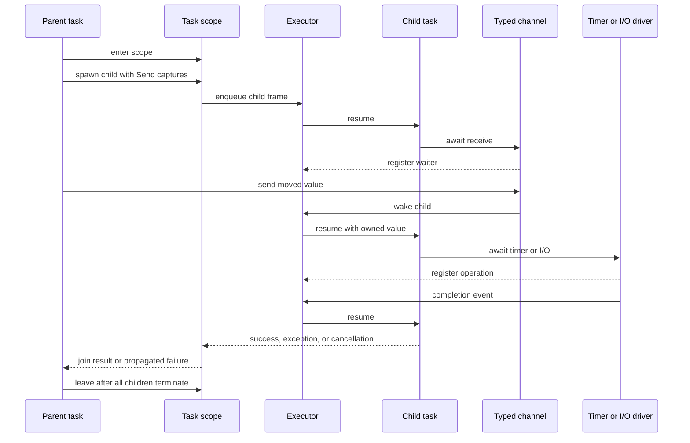

## Decision Summary

Realm should use structured async tasks as its primary concurrency model. A task
belongs to a lexical or dynamic scope, children cannot outlive that scope,
failure cancels unfinished siblings, cancellation propagates downward, and the
parent observes completion or failure at a defined join point.

Typed channels complement tasks for ownership transfer and synchronization.
Rust-like ownership, exclusive borrowing, capture analysis, and compiler-derived
sendability prevent data races in safe code. A bounded runtime executor maps
Realm tasks onto Windows OS threads and integrates timers and asynchronous I/O.

This is a composition of mechanisms, not an attempt to expose every concurrency
paradigm at once:

* Structured tasks own lifetime, cancellation, and error propagation
* Ownership and sendability own static safety
* Channels own message transfer and synchronization
* The executor owns scheduling and platform event integration
* Unsafe FFI boundaries own external synchronization contracts

Actors, detached tasks, raw user threads, shared mutable synchronization
primitives, channel selection, and scheduler controls are deferred.

## Evaluation Criteria

The comparison uses these criteria:

* Safety against data races, use after free, and ownership violations
* Child lifetime and resource cleanup
* Error propagation and interaction with declared `throws`
* Cancellation propagation and responsiveness
* Communication and shared-state ergonomics
* Compatibility with deterministic destruction and borrowing
* Suitability for CPU work, high-concurrency I/O, and AI-oriented pipelines
* Runtime complexity, memory overhead, and scheduler control
* FFI and blocking-call behavior
* Deterministic testing, debugging, stack traces, and observability
* LLVM lowering and Windows implementation feasibility
* Evolution cost for actors, parallelism, and additional platforms

No runtime model alone provides static race freedom. The safety score therefore
includes the compile-time ownership model that would need to accompany it.

## Option 1: OS Threads and Shared Memory

Each user-visible concurrency unit is an operating-system thread. Tasks
communicate through shared values guarded by locks, condition variables,
atomics, or other synchronization primitives.

### Strengths

* Direct match for CPU parallelism and blocking C APIs
* Familiar native debugger stacks and operating-system tooling
* Little scheduler implementation in the Realm runtime
* Predictable mapping between a language thread and an OS thread
* Mature Windows synchronization primitives

### Weaknesses

* Per-thread stack and kernel scheduling costs constrain high fan-out workloads
* Thread lifetime is unstructured unless Realm adds a separate scope model
* Cancellation is not safely preemptive; cooperative cancellation is still
  required
* Locks and atomics expose deadlock, priority inversion, starvation, and memory
  ordering complexity
* Async I/O either blocks threads or requires a second event-driven abstraction
* Parent/child error propagation has no natural language-level rule
* Deterministic tests are difficult because OS scheduling remains dominant

### Static Safety Implications

Ownership and sendability could make shared-memory threads race-safe, as Rust
demonstrates with `Send`, `Sync`, mutexes, and scoped threads. Realm would still
need explicit rules for aliasing, atomics, and lock-protected interior
mutability. This is nearly the same type-system burden as structured tasks with
less control over resource lifetime.

### Fit

Good for low-level systems and coarse CPU parallelism. Poor as the sole model
for high-concurrency I/O and library composition. Realm should use OS threads
inside the runtime worker pool and for isolated blocking work, not expose them as
the MVP's primary abstraction.

## Option 2: CSP-Style Lightweight Tasks and Channels

Programs create lightweight tasks and communicate primarily through channels,
following Communicating Sequential Processes and Go-like practice.

### Strengths

* Natural expression of pipelines, fan-out, fan-in, and producer-consumer work
* Lightweight task stacks or frames support high concurrency
* Channel operations establish clear synchronization points
* Fits streaming, service, and many AI data-pipeline workloads
* Event-driven I/O can share one scheduler with task wakeups

### Weaknesses

* Unscoped task creation permits task leaks and hidden lifetime dependencies
* Channels do not by themselves prevent races through separately shared values
* Closing, capacity, fairness, selection, and cancellation create a large
  semantic surface
* Failure in one task has no universal parent or sibling propagation path
* Stackful tasks complicate stack scanning, unwinding, FFI, and debugger stacks;
  stackless tasks complicate async lowering and source-level stepping

### Static Safety Implications

Owned send operations can transfer non-copy values, and shared sends can require
an immutable or synchronized type. This combines well with Realm ownership.
Channels become less safe if references into a sender's stack can be transmitted
or if task lifetimes are unbounded.

### Fit

Excellent communication mechanism and workload fit, but incomplete as a task
lifetime and failure model. Realm adopts typed channels and lightweight tasks
while rejecting unstructured task spawning in the MVP.

## Option 3: Structured Async Tasks

Async functions may create child tasks only inside a scope that waits for them.
The task tree determines lifetime, cancellation, failure propagation, and
ownership of child results.

### Strengths

* Child tasks cannot silently outlive borrowed data or their logical operation
* Parent exit gives a natural cleanup and cancellation boundary
* Child failures can propagate through declared effects and cancel siblings
* Stackless frames support high-concurrency I/O without one native stack per task
* Scope structure improves traces, leak detection, quotas, and deterministic
  tests
* Task capture rules can align with affine ownership and borrowing
* Channels remain available without owning the task-lifetime model

### Weaknesses

* Async lowering, suspension safety, task frames, wakeups, and executor behavior
  require substantial compiler/runtime work
* Cooperative cancellation cannot stop CPU-bound code that never reaches a
  cancellation point
* Blocking FFI calls can stall worker threads unless explicitly isolated
* Parent-visible failure timing, sibling failure aggregation, and scope-exit
  precedence require precise specification
* Source-level debugger reconstruction for stackless tasks is difficult

### Static Safety Implications

Scopes make non-escaping child borrows possible in principle, but suspension and
parallel execution still require strict rules. The conservative MVP transfers
owned `Send` values into parallel child tasks, allows immutable shared values
only when `Sync`, and rejects borrowed mutable captures. A child that is proven
non-suspending and sequential may eventually admit broader scoped borrows, but
that is not needed initially.

### Fit

Best overall fit for Realm's safety, I/O, cleanup, exception, and composability
goals. CPU parallelism is available by running child tasks concurrently on the
worker pool. This is the recommended primary model.

## Option 4: Actors and Isolation

Mutable state belongs to an actor and may be accessed only in actor-isolated
code. Other tasks interact through asynchronous messages.

### Strengths

* Strong conceptual isolation of mutable state
* Natural encapsulation for services, sessions, devices, and UI state
* Message queues serialize access without exposing locks
* Distribution and supervision can evolve from actor identities
* Actor references can provide a clear restricted capability

### Weaknesses

* Actor reentrancy across suspension points is subtle
* Mailbox capacity, ordering, backpressure, fairness, and failure supervision
  require policy
* Request-response calls introduce additional exception and cancellation paths
* Fine-grained numerical and local data-parallel code maps poorly to actors
* Every mutable object becoming an actor would impose allocation and scheduling
  overhead
* Actor lifetime does not automatically make spawned work structured

### Static Safety Implications

Actor isolation can prevent direct shared-state races, but transferred messages
still need sendability or deep-copy rules. Non-actor data and FFI still require a
memory model. Actor reference capabilities, as demonstrated by Pony, could offer
strong guarantees but would significantly expand the initial type system.

### Fit

Useful future library or language layer for stateful services, not the MVP's
universal concurrency model. Actors can later be built over structured tasks,
typed mailboxes, sendability, and cancellation scopes.

## Decision Matrix

Ratings are relative for Realm's stated goals: `High`, `Medium`, or `Low` fit.

| Criterion | OS threads | CSP tasks/channels | Structured async tasks | Actors/isolation |
|---|---|---|---|---|
| Static race safety with Realm ownership | High | High | High | High |
| Inherent child lifetime structure | Low | Low | High | Medium |
| Error and cancellation composition | Low | Medium | High | Medium |
| High-concurrency async I/O | Low | High | High | High |
| Coarse CPU parallelism | High | High | High | Medium |
| AI data pipelines | Medium | High | High | Medium |
| Shared-state ergonomics | High | Medium | Medium | Low |
| Deterministic cleanup fit | Medium | Medium | High | Medium |
| FFI and blocking-call fit | High | Medium | Medium | Medium |
| Runtime implementation simplicity | High | Medium | Low | Low |
| Debugging and native stacks | High | Medium | Medium | Medium |
| Deterministic scheduler testing | Low | High | High | High |
| Future distribution model | Low | Medium | Medium | High |
| Overall Realm fit | Medium | Medium | High | Medium |

The `High` safety rating assumes Realm's ownership and sendability rules. Without
them, OS threads, channels, and structured tasks all permit shared-memory races.

## Task and Scope Semantics

The root program executes in a root task and root scope. An async function may
suspend and may enter a child scope. Child creation returns a typed task handle
owned by the scope. Handles cannot escape the scope in the MVP.

A scope closes as follows:

1. Its body completes, returns, throws, or receives cancellation
2. If normal completion leaves children running, the scope waits for them
3. The first observed child failure marks the scope failed and requests
   cancellation of unfinished siblings
4. Every child runs cleanup and reaches a terminal state
5. The scope returns results, propagates a failure, or propagates cancellation
   according to an explicit precedence rule

The initial precedence proposal is body exception, first child exception in
deterministic child-creation order among observed failures, then cancellation.
Other failures are attached as suppressed diagnostic context. This policy
requires a specification spike because scheduling completion order must not make
program-visible exception identity accidentally nondeterministic.

Scope exit is an implicit join, but APIs should permit explicit await of an
individual result. Await consumes or borrows the task handle according to the
result-access design and is a cancellation point.

Detached tasks are excluded because they break lexical resource accounting and
borrow lifetime. Long-lived services use a scope owned by an application
component rather than an unowned global spawn.

## Async Function Lowering

An async function lowers to a state machine with:

* A discriminant identifying its current state
* Storage for parameters, owned locals live across suspension, and result state
* Cleanup state for initialized values
* Parent scope and cancellation references
* Wait registration for timers, channels, task joins, or I/O
* Resume and unwind entry points

CFG liveness decides which values enter the task frame. Borrow analysis runs
before final frame layout and treats each suspension as a boundary. A reference
may cross suspension only when its owner is guaranteed to outlive the entire
frame and concurrent access remains valid. The conservative MVP initially
rejects mutable borrows across suspension and restricts shared borrows to stable,
`Sync` storage.

LLVM's [coroutine support](https://llvm.org/docs/Coroutines.html) is an available
lowering mechanism, not a source-language semantic model. A spike must compare
LLVM coroutine intrinsics with Realm-owned state-machine lowering. Realm-owned
lowering offers stable control over cleanup and ABI; LLVM intrinsics may improve
optimization and reduce custom transformation work.

## Ownership and Sendability

Realm derives two semantic properties, with explicit negative declarations
reserved for special standard-library or FFI types:

* `Send`: ownership of a value may move to a task that can run on another thread
* `Sync`: shared references to a value may be accessed from multiple tasks

Primitive immutable values are `Send` and `Sync`. Aggregates derive each
property only when all semantically reachable fields satisfy it. Raw pointers,
thread-affine handles, task-local guards, and foreign objects are not implicitly
sendable. Mutable shared state requires a future standard synchronization type
whose safe API establishes exclusive access.

A parallel child capture is classified as move, immutable share, or rejected:

* A moved capture requires `Send` and becomes unavailable to the parent until a
  returned value restores ownership
* An immutable shared capture requires `Sync` and a lifetime covering scope join
* A mutable borrowed capture is rejected in the conservative MVP
* Capturing a non-sendable owner or a reference with insufficient lifetime is
  rejected

These properties follow the safety role of Rust
[`Send` and `Sync`](https://doc.rust-lang.org/nomicon/send-and-sync.html), but the
exact Realm derivation and unsafe implementation rules remain blocked by
ADR-008 and `QUE-007`.

## Memory Model

Realm safe code must be data-race free. A data race is concurrent conflicting
access to one memory location, at least one access is a write, and the accesses
are not ordered by a synchronizes-with relation.

The initial synchronizes-with candidates are:

* Child creation publishes moved and shared captures to the child
* Child completion publishes its writes to successful await or scope join
* Channel send publishes the message and preceding writes to the matching
  receive
* Channel close publishes closure to a receive that observes it
* Cancellation request publishes the request to a cancellation observation
* Runtime synchronization types define operation-specific edges

The transitive closure with sequenced-before forms happens-before. Ordinary
non-atomic conflicting accesses not ordered by happens-before are rejected by
safe type and borrow rules; unsafe code that causes such a race has undefined
behavior. The exact atomic model is deferred with user-visible atomics.

This vocabulary follows the [Go memory model](https://go.dev/ref/mem) and LLVM's
[atomic model](https://llvm.org/docs/Atomics.html). Realm must publish its own
normative model before concurrency leaves experimental status; LLVM ordering is
the backend implementation target, not the language specification.

## Cancellation

Cancellation is cooperative, idempotent, and downward-propagating. A scope owns
a cancellation state inherited by children. Requesting cancellation wakes
children blocked in Realm runtime operations.

Cancellation points include:

* Awaiting a task
* Sending to or receiving from a channel when blocking is possible
* Timer waits
* Async I/O waits
* Explicit cancellation checks
* Scope entry or loop backedges only if a later responsiveness profile justifies
  compiler-inserted checks

At a cancellation point, the async operation returns or propagates a distinct
cancellation outcome. Cancellation triggers deterministic cleanup and cannot be
silently swallowed without an explicit API. It does not asynchronously unwind a
thread at an arbitrary instruction.

Cancellation and exceptions are distinct effects per `REQ-026`. The type-system
spike decides whether cancellation appears as an implicit effect of every async
function, a distinguished typed result, or a reserved exception class that
cannot satisfy arbitrary catches. Implementation convenience must not erase the
semantic distinction.

## Exceptions and Child Failure

An async function retains its declared `throws` effect. A task stores successful
completion, exception, or cancellation in its terminal state. Awaiting a failed
task rethrows at the await point; scope exit propagates unobserved child failure.

Unwinding within a running task destroys initialized task-frame values in
reverse ownership order. An exception is captured at the task boundary rather
than unwinding through scheduler Rust frames. This makes the task terminal state
the bridge between native exception mechanics inside Realm code and structured
failure propagation across tasks.

The exception ABI spike must prove that a Realm throw can unwind generated Realm
frames, run cleanups, stop at the task trampoline, and become a typed terminal
state without crossing an incompatible C or Rust frame.

## Typed Channels

A channel is a typed runtime object with sender and receiver capabilities.
Sending moves a non-copy message unless its type explicitly supports copy.
Receiving transfers ownership to the receiver.

The proposed first channel has fixed bounded capacity selected at creation.
Capacity zero provides rendezvous only if the runtime spike demonstrates clear
cancellation and fairness behavior. Unbounded channels are deferred because
they hide memory growth and backpressure.

Required semantics before implementation include:

* Behavior when the last sender or receiver is dropped
* Whether explicit close exists and which capability may invoke it
* Send and receive results after closure
* Ordering among messages from one sender and from multiple senders
* Wakeup fairness and whether fairness is a guarantee or quality target
* Cancellation races with a matching operation
* Destruction of buffered but unreceived values

Multi-channel selection is deferred. It materially expands fairness,
cancellation, registration, and ownership behavior.

## Scheduler

The proposed Windows runtime uses a bounded worker pool sized from available CPU
parallelism and configurable for tests. Ready tasks enter local queues with a
global injection path; idle workers may steal. Timers and I/O completion events
wake tasks without dedicating a blocked worker to each operation.

Work stealing is a runtime recommendation, not a language guarantee. Programs
must not observe worker identity, queue order, or task migration except through
documented synchronization. The executor may begin as a deterministic
single-thread queue and add parallel workers after semantic tests pass.

The scheduler must provide:

* Bounded worker creation and queue accounting
* No lost wakeup between polling and wait registration
* Fairness sufficient to prevent persistent starvation under documented limits
* Scope and task IDs for tracing
* Cancellation wakeup
* Clean process shutdown after root scope completion
* A deterministic mode with controlled runnable-task choice and virtual time

Priorities, affinity, deadlines, custom executors, and direct scheduler access
are deferred.

## Windows Timers and Async I/O

The runtime should use Windows I/O completion facilities behind a platform event
driver. IOCP is the leading candidate, but the spike must assess current Windows
APIs, cancellation support, file and socket differences, overlapped-operation
lifetimes, and integration with the Rust runtime implementation.

Each in-flight operation owns or pins the native buffers and bookkeeping it
needs until completion or confirmed cancellation. Dropping a Realm future must
not free memory still referenced by the kernel. Completion and cancellation may
race; exactly one terminal result and one cleanup path must win.

The MVP async I/O surface should be the smallest set needed to validate the
event driver. Broad filesystem and networking APIs remain standard-library
follow-ups.

## Blocking and FFI

An unknown foreign function is treated as blocking and non-cancellable unless
declared otherwise by an unsafe contract. Calling it on an executor worker may
starve unrelated tasks.

The runtime therefore needs a bounded blocking pool or explicit blocking scope.
Cancellation can abandon observation but cannot forcibly terminate arbitrary C
code. Arguments moved to a blocking operation remain owned by that operation
until it returns. Realm exceptions are caught before crossing the C ABI; foreign
exceptions must not enter Realm unless a dedicated adapter translates them.

Thread-affine foreign handles are non-sendable by default and can be used only
on an owning thread or actor-like future abstraction.

## Determinism and Testing

Realm does not guarantee deterministic production scheduling. It does require
deterministic testing facilities:

* Single-thread executor with a seeded or scripted runnable-task selector
* Virtual clock for timers
* Injectable I/O completion source
* Trace of task creation, wake, poll, completion, cancellation, and channel
  events
* Exhaustive bounded schedule exploration for small litmus tests where feasible
* Stress mode on the parallel worker pool

Litmus tests cover publication, channel ordering, cancellation races, lost
wakeups, sibling failure, cleanup exactly once, close races, task-frame lifetime,
and blocking-pool exhaustion. Compiler compile-fail tests cover non-sendable
captures, moved parent values, escaping task handles, mutable aliases, and
borrows across suspension.

## Debugging and Observability

Every task and scope receives a runtime ID. Debug builds retain parent scope,
creation location, current suspension location, cancellation state, and terminal
failure summary. Tracing hooks must be present but cheap when disabled.

Native debug information covers currently executing generated frames. Suspended
task stacks require runtime reconstruction from task-frame metadata. The first
MVP gate is truthful task and source location reporting, not a full debugger
visualizer.

Uncaught root failures print the logical async stack, suppressed child failures,
and relevant scope/task IDs. Production behavior must not depend on tracing
being enabled.

## Runtime Interaction

If the child fails, the scope requests cancellation of unfinished siblings,
wakes blocked runtime operations, waits for cleanup, and propagates the selected
failure to the parent.

## Compiler and Runtime Responsibilities

The compiler owns:

* Async and task syntax and effect checking
* Capture classification, sendability, and suspension borrow checks
* Task-scope and channel type checking
* State-machine and cleanup CFG lowering
* Runtime ABI call generation and debug metadata
* Rejection of unsafe cross-task aliases

The runtime owns:

* Task allocation, queues, workers, wakeups, and terminal state
* Scope child accounting and cancellation state
* Channel storage and synchronization
* Timer and I/O registration and completion
* Blocking-call pool
* Tracing and suspended-frame metadata

The standard library owns ergonomic APIs over compiler-known operations and
runtime ABI calls. It cannot weaken compiler capture or sendability checks.

## Decision Dependencies

ADR-007 may be accepted after a stackless task and scope prototype demonstrates
cleanup, cancellation, and debugger metadata. ADR-008 remains blocked until the
sendability and memory-model note resolves `QUE-007`.

The following questions gate production concurrency tasks:

* `QUE-006`: Exception ABI and task-boundary capture
* `QUE-007`: Sendability derivation and suspension borrows
* `QUE-008`: Executor and Windows event-driver implementation
* `QUE-009`: Channel capacity, closure, fairness, and selection scope

## Validation Gates

Concurrency is experimental until all gates pass:

1. Type rules reject non-sendable captures and conflicting cross-task access
2. Async lowering preserves values and runs each cleanup exactly once on normal,
   exceptional, and cancelled paths
3. Scope tests prove children do not outlive parents and failure cancels siblings
4. Channel litmus tests prove ownership transfer and documented happens-before
5. Deterministic executor tests cover every cancellation and wakeup race class
6. Parallel stress tests run cleanly under available Rust sanitizers and model
   checking for the runtime implementation
7. Windows timer and I/O tests prove buffer lifetime and exactly-once completion
8. Debug builds report useful logical task stacks and source suspension points
9. Blocking C calls cannot exhaust the normal worker pool under configured bounds

## Source Precedents

* [Swift structured concurrency](https://github.com/swiftlang/swift-evolution/blob/main/proposals/0304-structured-concurrency.md)
  establishes child lifetime, task trees, cancellation propagation, and child
  error behavior
* [Rust `Send` and `Sync`](https://doc.rust-lang.org/nomicon/send-and-sync.html)
  establishes unsafe marker properties for transfer and shared access
* [Go memory model](https://go.dev/ref/mem) establishes happens-before and
  channel synchronization vocabulary
* [Effective Go concurrency](https://go.dev/doc/effective_go#concurrency)
  demonstrates lightweight task and channel composition while explicitly not
  making message passing a universal rule
* [Erlang concurrent programming](https://www.erlang.org/doc/system/conc_prog.html)
  demonstrates isolated processes and asynchronous message passing
* [Pony actors](https://www.ponylang.io/reference/actors/) and
  [reference capabilities](https://www.ponylang.io/reference/capabilities/)
  demonstrate actor scheduling and capability-based race prevention
* [LLVM atomics](https://llvm.org/docs/Atomics.html) defines the backend atomic
  ordering model
* [LLVM coroutines](https://llvm.org/docs/Coroutines.html) defines available
  coroutine-lowering intrinsics without prescribing Realm semantics

The recommendation and exact composition are Realm architectural judgment. The
sources provide mechanisms and precedents, not a ready-made Realm specification.