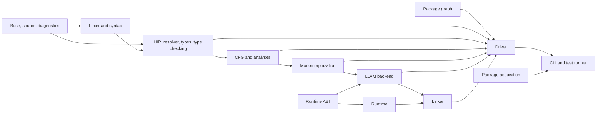

## Structure Principles

The workspace should make architectural violations difficult to express. Crates
are organized by stable data ownership and testable stage contracts, not by one
crate per compiler pass or one large compiler crate.

The proposed structure follows these rules:

* Core IDs, source ranges, diagnostics, symbols, syntax, semantic IR, and CFG IR
  are independent of LLVM and runtime implementation
* A representation crate owns data shapes; an analysis crate owns algorithms
  that consume and produce them
* The compiler driver orchestrates stages but contains no pass implementation
* The CLI contains process-facing concerns but no compiler semantics
* Package acquisition is separate from the package graph consumed by analysis
* Generated code and the runtime share only a versioned ABI description
* Inkwell appears in one backend crate
* Platform-specific runtime code remains behind a runtime platform module
* Crates are created only when their roadmap task begins

This is a target layout. The current root package remains unchanged until the
workspace-bootstrap task is approved.

## Proposed Workspace Tree

```text
Realm/
|-- Cargo.toml
|-- Cargo.lock
|-- rust-toolchain.toml
|-- README.md
|-- docs/
|   |-- planning/
|   `-- specifications/
|       |-- lexical-grammar.md
|       |-- grammar.md
|       |-- type-system.md
|       |-- ownership.md
|       |-- exceptions.md
|       |-- concurrency.md
|       |-- memory-model.md
|       |-- modules-and-packages.md
|       `-- abi.md
|-- compiler/
|   |-- realm-base/
|   |   `-- src/lib.rs
|   |-- realm-source/
|   |   `-- src/lib.rs
|   |-- realm-diagnostics/
|   |   `-- src/lib.rs
|   |-- realm-lexer/
|   |   `-- src/lib.rs
|   |-- realm-syntax/
|   |   `-- src/lib.rs
|   |-- realm-hir/
|   |   `-- src/lib.rs
|   |-- realm-resolve/
|   |   `-- src/lib.rs
|   |-- realm-types/
|   |   `-- src/lib.rs
|   |-- realm-typeck/
|   |   `-- src/lib.rs
|   |-- realm-cfg/
|   |   `-- src/lib.rs
|   |-- realm-analysis/
|   |   `-- src/lib.rs
|   |-- realm-mono/
|   |   `-- src/lib.rs
|   |-- realm-runtime-abi/
|   |   `-- src/lib.rs
|   |-- realm-codegen-llvm/
|   |   `-- src/lib.rs
|   |-- realm-link/
|   |   `-- src/lib.rs
|   |-- realm-package/
|   |   `-- src/lib.rs
|   |-- realm-driver/
|   |   `-- src/lib.rs
|   `-- realm-test-support/
|       `-- src/lib.rs
|-- runtime/
|   `-- realm-runtime/
|       |-- src/
|       |   |-- lib.rs
|       |   |-- exception/
|       |   |-- memory/
|       |   |-- task/
|       |   |-- channel/
|       |   |-- time/
|       |   |-- io/
|       |   `-- platform/windows/
|       `-- tests/
|-- tools/
|   |-- realm-cli/
|   |   `-- src/main.rs
|   |-- realm-test-runner/
|   |   `-- src/main.rs
|   `-- realm-package-fetch/
|       `-- src/lib.rs
|-- library/
|   |-- core/
|   |-- std/
|   `-- test/
|-- tests/
|   |-- ui/
|   |-- parse/
|   |-- run-pass/
|   |-- run-fail/
|   |-- codegen/
|   |-- abi/
|   |-- concurrency/
|   |-- debug-info/
|   `-- packages/
|-- benchmarks/
|   |-- compiler/
|   `-- runtime/
|-- examples/
`-- scripts/
```

The root `src/` directory disappears only when the current package is converted
to a virtual workspace. Its lexer experiment should first be captured in a
fixture or intentionally retired by the bootstrap task; it must not be copied
unchanged into the production lexer.

## Compiler Crates

### `realm-base`

Status: MVP, created first.

Owns small dependency-free identities and utilities shared across stage data:
newtyped IDs, interned symbol handles, target-neutral indices, and deterministic
collection aliases where justified.

Public boundary: Stable value types with no file I/O or global mutable state.

Allowed dependencies: Rust standard library and narrowly approved foundational
crates.

Forbidden dependencies: Every other Realm crate, serialization frameworks by
default, Inkwell, platform APIs, CLI libraries.

### `realm-source`

Status: MVP, created first.

Owns source snapshots, `FileId`, UTF-8 byte ranges, logical paths, line indices,
and source loading interfaces. Physical filesystem loading is injected by the
driver.

Public boundary: Immutable source access and byte-to-display-position queries.

Allowed dependencies: `realm-base`.

Forbidden dependencies: Lexer, syntax, semantic types, package acquisition,
runtime, LLVM.

### `realm-diagnostics`

Status: MVP, created first.

Owns diagnostic codes, severities, labels, edits, applicability, collections,
human rendering, and versioned JSON rendering. It may query source content only
through a narrow interface.

Public boundary: Structured diagnostic values and renderers.

Allowed dependencies: `realm-base`, `realm-source`.

Forbidden dependencies: Compiler stage crates, CLI output, Inkwell, runtime.

### `realm-lexer`

Status: MVP.

Owns token kinds, trivia kinds, raw tokenization, and literal-boundary errors.
The `logos` dependency remains here only if the lexer spike retains it.

Public boundary: Token stream with source ranges and lexical diagnostics.

Allowed dependencies: `realm-base`, `realm-source`, `realm-diagnostics`, and
the selected lexer implementation dependency.

Forbidden dependencies: Syntax nodes, HIR, types, packages, LLVM, runtime.

### `realm-syntax`

Status: MVP.

Owns parser events, syntax kinds, lossless CST storage, typed AST wrappers,
grammar entry points, parse diagnostics, and syntax debug rendering.

Public boundary: Immutable syntax trees detached from parser state plus typed
source-shaped accessors.

Allowed dependencies: `realm-base`, `realm-source`, `realm-diagnostics`,
`realm-lexer`, and the selected tree library.

Forbidden dependencies: Definition IDs, inferred types, HIR, package loading,
LLVM, runtime.

### `realm-hir`

Status: MVP.

Owns definition, body, expression, pattern, and semantic-source-map data types.
It contains resolved-path slots and error sentinels but no resolution algorithm.

Public boundary: Arena or indexed immutable HIR and stable semantic IDs.

Allowed dependencies: `realm-base`, `realm-source`, `realm-syntax` for lowering
input types only when unavoidable.

Forbidden dependencies: Resolver implementation, type checker, CFG, LLVM,
runtime.

Preferred refinement: Keep syntax-to-HIR lowering in `realm-resolve` so
`realm-hir` need not depend on concrete syntax storage.

### `realm-resolve`

Status: MVP.

Owns package/module collection, scope construction, visibility, namespaces,
imports, cycle diagnostics, definition allocation, and syntax-to-resolved-HIR
lowering.

Public boundary: Resolved package HIR, module graph, definition tables, and
diagnostics.

Allowed dependencies: Base, source, diagnostics, syntax, HIR, package graph.

Forbidden dependencies: Type checking, CFG analysis, LLVM, runtime, package
network acquisition.

### `realm-types`

Status: MVP.

Owns canonical type values, `TypeId`, effects, generic parameters, substitutions,
constraints, ownership categories, layouts at a target-neutral level, and type
formatting.

Public boundary: Interned immutable semantic types and substitutions.

Allowed dependencies: `realm-base`, selected HIR identity types.

Forbidden dependencies: Type inference state, CFG implementation, LLVM types,
runtime layouts, source parsing.

### `realm-typeck`

Status: MVP.

Owns inference variables, unification, coercion, generic obligation checking,
literal checking, pattern typing, exhaustiveness, effect checking, sendability
obligations, and typed-HIR production.

Public boundary: Typed body/package results, obligation sets, and diagnostics.

Allowed dependencies: Base, source, diagnostics, HIR, types.

Forbidden dependencies: Syntax traversal except through HIR source maps, CFG
lowering, LLVM, runtime.

### `realm-cfg`

Status: MVP.

Owns typed CFG data: functions, locals, places, operands, statements,
terminators, unwind edges, cleanup scopes, async operations, and validation.

Public boundary: Immutable validated CFG bodies and builder APIs used by one
lowering layer.

Allowed dependencies: `realm-base`, `realm-source`, `realm-hir`, `realm-types`.

Forbidden dependencies: Analysis algorithms, LLVM, runtime implementation,
syntax.

### `realm-analysis`

Status: MVP.

Owns CFG construction from typed HIR and dataflow for definite initialization,
moves, borrowing, non-lexical end points, cleanup elaboration, suspension safety,
return completeness, and unreachable code.

Public boundary: Validated and cleanup-elaborated CFG plus analysis diagnostics.

Allowed dependencies: Base, source, diagnostics, HIR, types, type checking
result types, CFG.

Forbidden dependencies: Monomorphization, LLVM, scheduler/runtime code.

If borrow checking grows independently, split `realm-borrowck` only after a
measured ownership boundary emerges. Do not pre-create it.

### `realm-mono`

Status: MVP after generics.

Owns reachability roots, canonical instance keys, substitution, instance graph,
expansion limits, symbol mangling, and monomorphic CFG production.

Public boundary: Deterministically ordered monomorphic program and symbols.

Allowed dependencies: Base, diagnostics, HIR identities, types, CFG.

Forbidden dependencies: Inkwell, linker, runtime implementation, syntax.

### `realm-runtime-abi`

Status: MVP before generated runtime calls.

Owns internal ABI version, symbol names, calling conventions, primitive and
aggregate layouts, status codes, and runtime capability declarations. Both
compiler and runtime depend on it.

Public boundary: Data-only target ABI contract and validation helpers.

Allowed dependencies: `realm-base`; platform constants behind explicit target
modules.

Forbidden dependencies: Inkwell, compiler IR, executor implementation, CLI.

### `realm-codegen-llvm`

Status: MVP after ADR-011 is accepted.

Owns target initialization, layout mapping, calling convention mapping, LLVM
context/module construction, CFG lowering, exception and coroutine lowering,
runtime-call declarations, debug information, verification, optimization, and
object emission.

Public boundary: Backend request, verified artifact metadata, object bytes or
path, and backend diagnostics.

Allowed dependencies: Base, diagnostics, types, CFG, monomorphized program,
runtime ABI, pinned Inkwell.

Forbidden dependencies: Syntax, resolver implementation, type inference,
package acquisition, runtime implementation, CLI.

### `realm-link`

Status: MVP.

Owns Windows toolchain discovery interfaces, linker command models, response
files, runtime/system-library inputs, process invocation adapter, and linker
diagnostic capture.

Public boundary: Pure command construction plus an injected process runner.

Allowed dependencies: Base, diagnostics, runtime ABI, narrowly selected Windows
discovery crates.

Forbidden dependencies: Inkwell objects, semantic IR, syntax, runtime internals.

### `realm-package`

Status: Local-only subset in MVP; remote schema later.

Owns manifest data, logical package IDs, exact dependency specifications,
validated DAGs, module-path mapping, and an abstract resolved package graph.

Public boundary: Parsed and validated manifest plus source/package graph.

Allowed dependencies: Base, source, diagnostics, a structured manifest parser.

Forbidden dependencies: HTTP, Git process invocation, compiler stages, LLVM,
runtime.

### `realm-driver`

Status: MVP.

Owns build request/options, stage orchestration, stage-stop behavior, artifact
publication, temporary directories, and aggregate outcomes.

Public boundary: Library API taking an abstract filesystem, process runner,
package graph, and build request.

Allowed dependencies: All required compiler-stage crates, package graph,
backend, and linker.

Forbidden dependencies: CLI argument parsing, terminal styling policy, network
acquisition implementation, runtime internal Rust APIs.

### `realm-test-support`

Status: MVP as soon as syntax tests begin.

Owns fixture discovery, normalization of unstable paths, stage snapshot helpers,
compiler test directives, native execution sandbox interfaces, and structured
expectations shared by integration suites.

Public boundary: Test-only APIs; never a production dependency.

Allowed dependencies: Compiler driver and narrowly selected test libraries.

Forbidden dependencies: Production crates depending on it.

## Runtime Crate

### `realm-runtime`

Status: Minimal startup/console subset in early MVP; exception and concurrency
subsystems enter only after their gates.

Owns all Rust runtime implementation. Internal modules may be split into crates
later if independent testing, feature selection, or unsafe-code auditing needs a
stronger boundary.

Public boundary: Exported internal ABI symbols declared by `realm-runtime-abi`.
No generated Realm code depends on Rust-mangled symbols or Rust layouts.

Allowed dependencies: `realm-runtime-abi`, audited synchronization and Windows
API crates selected by spikes.

Forbidden dependencies: Compiler stages, Inkwell, CLI, package logic.

Unsafe Rust is permitted only in small modules that document invariants and have
direct tests. The default lint policy should deny unsafe operations outside
explicit unsafe blocks.

## Tool Crates

### `realm-cli`

Status: MVP.

Owns command-line parsing, environment resolution, terminal selection,
diagnostic rendering choice, exit codes, and invocation of driver or package
services.

Forbidden responsibilities: Parsing Realm syntax, implementing compiler passes,
constructing LLVM IR, or inspecting runtime internals.

### `realm-test-runner`

Status: MVP release gate after run-pass compilation exists.

Owns Realm test discovery, compilation requests, isolated execution, timeout,
captured output, filtering, and structured result reporting.

Forbidden responsibilities: Reimplementing the compiler harness or silently
granting unsafe runtime capabilities.

### `realm-package-fetch`

Status: Later, blocked by ADR-010.

Owns HTTPS/Git retrieval, immutable content identity, trust policy, cache,
offline mode, update, and acquisition diagnostics. It produces inputs for
`realm-package`; semantic crates never depend on it.

## Realm Library Directories

`library/core` contains compiler-known, allocation-free foundations and
intrinsic declarations. `library/std` contains owned strings, vectors,
formatting, console, time, task, channel, and I/O APIs. `library/test` contains
the Realm-facing test API.

Realm source library packages are not Rust workspace members. The compiler
build system treats them as pinned bootstrap inputs and records a compiler/runtime
ABI compatibility version.

Library code may call only declared intrinsics and runtime ABI wrappers. It may
not depend on compiler implementation details or undeclared LLVM behavior.

## Test Directories

* `tests/ui`: Compile-pass and compile-fail diagnostic fixtures
* `tests/parse`: Lossless syntax, recovery, and source round-trip fixtures
* `tests/run-pass`: Native programs expected to exit successfully
* `tests/run-fail`: Native programs expected to throw, abort, or report a
  controlled runtime failure
* `tests/codegen`: Focused LLVM and object assertions
* `tests/abi`: C/Realm calling, layout, unwind-boundary, and linker probes
* `tests/concurrency`: Deterministic litmus tests and parallel stress programs
* `tests/debug-info`: Symbol, source mapping, stack, and debugger fixtures
* `tests/packages`: Manifest, graph, visibility, cycle, and acquisition fixtures

Small unit tests remain beside the owning Rust module. Cross-crate behavior goes
in these top-level suites. A fixture belongs to the earliest boundary capable of
detecting the defect.

## Allowed Dependency Layers



Within a layer, dependencies must still follow the crate-specific rules. The
diagram does not permit arbitrary mutual dependencies.

## Workspace-Wide Forbidden Dependencies

* No cycles among workspace crates
* No `realm-*` production crate depends on `realm-cli`, `realm-test-runner`, or
  `realm-test-support`
* No source, syntax, HIR, type, CFG, analysis, or monomorphization crate depends
  on Inkwell, LLVM FFI, Windows APIs, HTTP, Git, or process execution
* No compiler crate depends on `realm-runtime`; generated code uses
  `realm-runtime-abi`
* No runtime crate depends on compiler representations
* No network access occurs in `realm build` or compiler-stage crates
* No crate reads process-global environment variables except CLI/toolchain
  boundary code
* No semantic operation depends on hash-map iteration order
* No public boundary exposes third-party syntax tree, LLVM, command-line, HTTP,
  or Windows handle types when a Realm-owned value type can isolate churn

These rules should become automated architecture tests after workspace
bootstrap.

## Dependency Policy

External dependencies require a short decision entry stating ownership,
maintenance status, unsafe surface, license, alternatives, and exit strategy.
Compiler fundamentals should prefer small libraries with stable formats and no
runtime services.

The root workspace pins the Rust toolchain and dependency versions. LLVM and
Inkwell are pinned as a tested pair. Platform dependencies use explicit feature
sets. Default features are disabled when they import irrelevant runtimes or
platforms.

One workspace lockfile is committed for the Rust implementation. This is
independent of Realm's future package-lock decision.

## Feature Flags

Feature flags may select expensive optional integration, not change language
semantics. Likely flags include LLVM debugging aids, runtime tracing, and test
instrumentation. The supported compiler must not accept different Realm
programs because a Rust feature flag changed.

Target selection belongs in build requests and target specifications, not Cargo
features. The MVP still supports only Windows x86-64 MSVC.

## Versioning Boundaries

The following versions evolve independently:

* Realm source-language edition or compatibility level
* Compiler CLI and diagnostic JSON schema
* Compiler-to-runtime internal ABI
* Realm standard-library package version
* Realm package manifest schema
* Rust implementation crate versions

The MVP may release them together, but must not conflate their compatibility
meaning. Internal Rust crate APIs remain unstable and workspace-private.

## Staged Crate Creation

Create crates only when an approved task needs them:

1. Foundation: base, source, diagnostics, lexer, syntax, test support, CLI
2. Semantics: package graph, HIR, resolver, types, type checking
3. Executable path: CFG, analysis subset, runtime ABI, LLVM backend, linker,
   driver, minimal runtime
4. Language depth: ownership analyses, monomorphization, standard library
5. Effects and concurrency: exception/runtime modules, async CFG operations,
   scheduler, channels, timers, I/O
6. Product gates: test runner, debug information, packaging extensions
7. Follow-ups: remote package fetch, formatter, LSP, documentation, REPL, and
   performance tools

This sequence avoids an empty-crate scaffold that appears architectural but has
no validated contract.